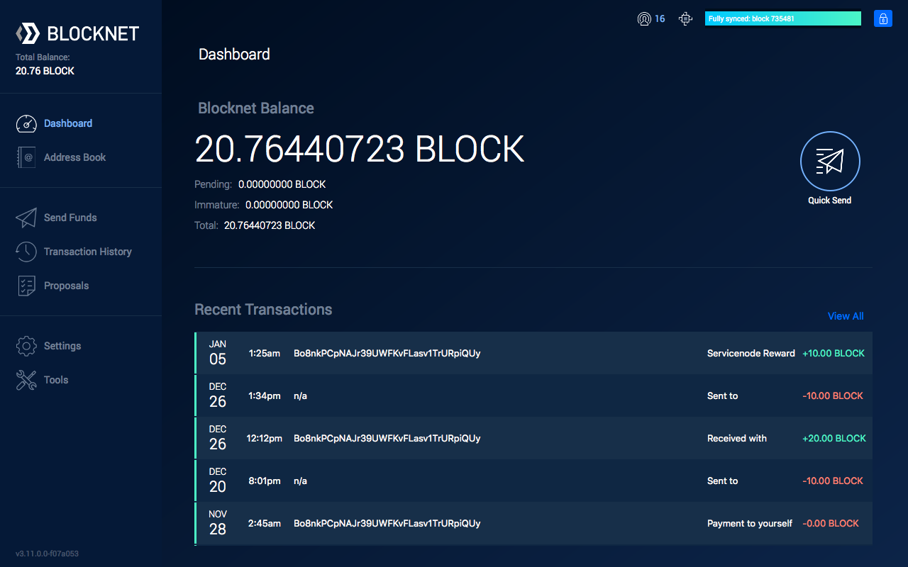
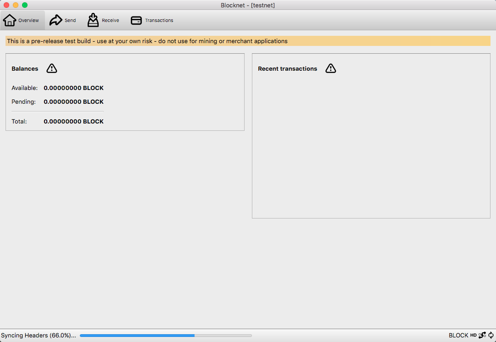

# Create a Proposal

This guide explains how to create and submit Blocknet Superblock proposals for funded initiatives to be voted on by the BLOCK holders. Proposal submission is important for the decentralized governance model to function properly.

### Proposal Submission Deadline[¶](https://docs.blocknet.co/governance/create-proposal/#proposal-submission-deadline) <a href="#proposal-submission-deadline" id="proposal-submission-deadline"></a>

The deadline for creating proposals is 2880 blocks prior to the Superblock.

Est. current Block Height: 2637078

Block Height at next Superblock: 2678400

Block Height at next SB proposal deadline: 2675520

Est. date of next SB proposal deadline: Wed Sep 14 2022 06:22:01 GMT+0200 (CEST)

Est. time till next SB proposal deadline: 26 days, 17 hours, and 47 minutes

### Create A Proposal[¶](https://docs.blocknet.co/governance/create-proposal/#create-a-proposal) <a href="#create-a-proposal" id="create-a-proposal"></a>

1. Submit a Draft Proposal to the [Blocknet Proposal Forum](https://forum.blocknet.co/c/draft-proposals).
   1. At the [Blocknet Proposal Forum](https://forum.blocknet.co/c/draft-proposals), you'll see this at the top of the page: 
   2. Select _Draft Proposal_ at the top left, then click _+ New Topic_ at the top right of the screen.
   3. Create a proposal, embedding [Markdown Text](https://pandao.github.io/editor.md/en.html) as desired for formatting, which clearly and accurately conveys the following relevant information:
      * Proposal name using only alpha-numerics (_example_: Qt-Exchange-Widget). Note, it's often useful to include the applicable SuperBlock number in the name, especially if you submit similar proposals each SuperBlock.
      * Previous work relevant to this proposal
      * What is being proposed
      * Rationale and further explanation of proposal & background info
      * Technical explanation/agenda of feature/proposal
      * Estimated time for components in the proposal
      * Teams/person undertaking and responsible for the work
      * Cost assessment
      * Fund custodians
2. Once the Draft Proposal has been submitted and posted to the forum, copy the post's URL and create a shortened URL at [https://bit.ly/](https://bit.ly/)
3. Continue on to [submit the proposal from the Qt wallet](https://docs.blocknet.co/governance/create-proposal/#submit-from-the-qt-wallet) or to [submit the proposal via command line](https://docs.blocknet.co/governance/create-proposal/#submit-from-the-terminal).
4.  (Optional) Once the proposal has been submitted, your proposal will be assigned a `proposal hash` (a large string of numbers and letter representing your proposal). If using the Command Line Interface, the `proposal hash` will be returned after submitting the proposal via the `createproposal` command. The `proposal hash` will be the `xxxx` value in the `"hash":"xxxx",` value returned. You can also display `proposal hash` and other information about all upcoming proposals as follows:

    * In Blocknet Qt/GUI wallet, go to _Tools->Debug Console_
    * Type `listproposals <last_SB_number + 1>` where `<last_SB_number + 1>` is 1 more than the [number of the previous SuperBlock](https://docs.blocknet.co/governance/introduction/#future-superblock-dates).
    * Or from CLI: `./blocknet-cli listproposals <last_SB_number + 1>`

    Once you have your proposal's `proposal hash`, you can now edit your post in the Proposal Forum to add the command for voting for your proposal from the command line, which is:

    ```
    vote [proposal hash] yes
    ```

    For example,

    ```
    vote 8333cdf2fbfe25a78e08876b6ed1bc5cd09efa9edbdf491d2a06e43faf252698 yes
    ```

### Submit a proposal from the Qt Wallet <a href="#submit-from-the-qt-wallet" id="submit-from-the-qt-wallet"></a>

<details>

<summary>Submit using the redesigned wallet</summary>



1. Open and sync the [Blocknet wallet](https://docs.blocknet.co/wallet/setup). The wallet needs to be unlocked to submit a proposal.
2. Ensure there is a minimum of 11 BLOCK in your wallet to pay for the proposal submission fee (10 BLOCK fee + transaction fee). This fee should be added to the proposal amount (in a later step) so that you are reimbursed if the proposal passes (see [passing criteria](https://docs.blocknet.co/governance/introduction/#passing-criteria)). If you would like to confirm the submission fee you can use the `proposalfee` command.
3. In the side menu, go to _Proposals_.
4. Click on the _Create New Proposal_ button at the top of the screen.
5. Fill out the form fields:
   * _Proposal name_ = The name of the proposal using only alpha-numerics.
     * _URL_ = The shortened URL for the proposal link created.
     * _Description_ = A short description of the proposal.
     * _Superblock #_ = The Superblock block number the proposal is being submitted for.
     * _Amount_ = The amount of funding requested (must be a whole number).
     * _Payment address_ = The BLOCK address the funding will be paid out to.
     * A total of 107 characters can be used for the proposal name, URL, and description combined.
6. Click the _Continue_ button at the bottom of the screen.
7. Follow the screens to review the information and submit the proposal.
8. Wait for the transaction to have 1 confirmation (about 1 minute) then verify the proposal has been properly submitted by [viewing the proposals](https://docs.blocknet.co/governance/view-proposals).

</details>

<details>

<summary>Submit using the classic wallet</summary>



* Open and sync the [Blocknet wallet](https://docs.blocknet.co/wallet/setup). The wallet needs to be unlocked to submit a proposal.
* Ensure there is a minimum of 11 BLOCK in your wallet to pay for the proposal submission fee (10 BLOCK fee + transaction fee). This fee should be added to the proposal amount (in a later step) so that you are reimbursed if the proposal passes (see [passing criteria](https://docs.blocknet.co/governance/introduction/#passing-criteria)). If you would like to confirm the submission fee you can use the `proposalfee` command.
* In the program menu, go to _Window_ > _Console_. The debug console will open in a new window.
*   The proposal submission command uses the following command structure (all one line):&#x20;

    ```
    createproposal [PROPOSAL_NAME] [SUPERBLOCK_BLOCK] [AMOUNT] [ADDRESS] [URL] [DESCRIPTION]
    ```

    * `SUPERBLOCK_BLOCK` = The Superblock block number the proposal is being submitted for.
    * `PROPOSAL_NAME` = The name of the proposal using only alpha-numerics.
    * Specifying a value of `0` automatically submits for the next Superblock. \* If you know the Superblock block number you wish to create a proposal for, then enter that value instead of `0`.
    * `AMOUNT` = The amount of funding requested.
      * `ADDRESS` = The BLOCK address the funding will be paid out to.
      * `URL` = The shortened URL for the proposal link created.
      * `DESCRIPTION` = A short description of the proposal.
      * A total of 107 characters can be used for PROPOSAL\_NAME, URL, and DESCRIPTION combined.
*   Type the above command replacing the variables with the respective values in place. Below is an example:

    ```
    createproposal privacy-mixer 0 100 Bxxxxxxxxxxxxxxxxxxxxxxxxx https://goo.gl/xxxxxxx "Build privacy mixer app"
    ```
* Press the _Enter_ key to submit the proposal to the network.
* Wait for the transaction to have 1 confirmation (about 1 minute) then verify the proposal has been properly submitted by [viewing the proposals](https://docs.blocknet.co/governance/view-proposals).

</details>

### Submit from the Terminal <a href="#submit-from-the-terminal" id="submit-from-the-terminal"></a>

<details>

<summary>Linux</summary>

1. Start the [wallet](https://docs.blocknet.co/wallet/setup). If it's not already running, use the following instructions to start it.&#x20;
   1. Navigate to the `bin` folder within your Blocknet wallet installation directory (EG: `~/blocknet/bin/`)
   2.  Type in the following command, replacing `[USERNAME]` and `[PASSWORD]` with the respective `rpcuser=` and `rpcpassword=` values from your `blocknet.conf` file located in your `~/.blocknet/` directory.

       ```
       ./blocknetd -rpcuser=[USERNAME] -rpcpassword=[PASSWORD] -daemon
       ```

       _Example:_

       ```
       ./blocknetd -rpcuser=JohnBlocknet -rpcpassword=supersecretpassword -daemon
       ```
2. The wallet process will begin in the current terminal window. You will need to open a new terminal window or tab and navigate to the same location before continuing.
3. If your wallet was just started, you may need to wait a few minutes for the wallet to sync.
4. Ensure there is a minimum of 11 BLOCK in your wallet to pay for the proposal submission fee (10 BLOCK fee + transaction fee). This fee should be added to the proposal amount (in a later step) so that you are reimbursed if the proposal passes (see [passing criteria](https://docs.blocknet.co/governance/introduction/#passing-criteria)). If you would like to confirm the submission fee you can use the `proposalfee` command.
5.  The proposal submission command uses the following command structure (all one line):&#x20;

    ```
    ./blocknet-cli createproposal [PROPOSAL_NAME] [SUPERBLOCK_BLOCK] [AMOUNT] [ADDRESS] [URL] [DESCRIPTION]
    ```

    *

        * `SUPERBLOCK_BLOCK` = The Superblock block number the proposal is being submitted for.

        `PROPOSAL_NAME` = The name of the proposal using only alpha-numerics.

        * Specifying a value of `0` automatically submits for the next Superblock. \* If you know the Superblock block number you wish to create a proposal for, then enter that value instead of `0`.
    * `AMOUNT` = The amount of funding requested.
      * `ADDRESS` = The BLOCK address the funding will be paid out to.
      * `URL` = The shortened URL for the proposal link created.
      * `DESCRIPTION` = A short description of the proposal.
      * A total of 107 characters can be used for PROPOSAL\_NAME, URL, and DESCRIPTION combined.
6.  Type the above command replacing the variables with the respective values in place. Below is an example:

    ```
    ./blocknet-cli createproposal privacy-mixer 0 100 Bxxxxxxxxxxxxxxxxxxxxxxxxx https://goo.gl/xxxxxxx "Build privacy mixer app"
    ```
7. Press the _Enter_ key to submit the proposal to the network.
8. Wait for the transaction to have 1 confirmation (about 1 minute) then verify the proposal has been properly submitted by [viewing the proposals](https://docs.blocknet.co/governance/view-proposals).

</details>

<details>

<summary>Windows</summary>


1. Start the [wallet](https://docs.blocknet.co/wallet/setup). If it's not already running, use the following instructions to start it.
2.  Type in the following command, replacing `[USERNAME]` and `[PASSWORD]` with the respective `rpcuser=` and `rpcpassword=` values from your `blocknet.conf` file located in the `C:\Users\[YourUsername]\AppData\Roaming\Blocknet` directory. This directory can be found by opening the file explorer and pasting in `%appdata%\Blocknet\` into the file explorer path field.

    ```
    ./blocknetd -rpcuser=[USERNAME] -rpcpassword=[PASSWORD] -daemon
    ```

    _Example:_

    ```
    ./blocknetd -rpcuser=JohnBlocknet -rpcpassword=supersecretpassword -daemon
    ```
3. The wallet process will begin in the current terminal window. You will need to open a new terminal window or tab and navigate to the same location before continuing.
4. If your wallet was just started, you may need to wait a few minutes for the wallet to sync.
5. Ensure there is a minimum of 11 BLOCK in your wallet to pay for the proposal submission fee (10 BLOCK fee + transaction fee). This fee should be added to the proposal amount (in a later step) so that you are reimbursed if the proposal passes (see [passing criteria](https://docs.blocknet.co/governance/introduction/#passing-criteria)). If you would like to confirm the submission fee you can use the `proposalfee` command.
6.  The proposal submission command uses the following command structure (all one line):&#x20;

    ```
    ./blocknet-cli createproposal [PROPOSAL_NAME] [SUPERBLOCK_BLOCK] [AMOUNT] [ADDRESS] [URL] [DESCRIPTION]
    ```

    * `SUPERBLOCK_BLOCK` = The Superblock block number the proposal is being submitted for.
    * `PROPOSAL_NAME` = The name of the proposal using only alpha-numerics.
    * Specifying a value of `0` automatically submits for the next Superblock. \* If you know the Superblock block number you wish to create a proposal for, then enter that value instead of `0`.
    * `AMOUNT` = The amount of funding requested.
    * `ADDRESS` = The BLOCK address the funding will be paid out to.
    * `URL` = The shortened URL for the proposal link created.
    * `DESCRIPTION` = A short description of the proposal.
    * A total of 107 characters can be used for PROPOSAL\_NAME, URL, and DESCRIPTION combined.
7.  Type the above command replacing the variables with the respective values in place. Below is an example:

    ```
    ./blocknet-cli createproposal privacy-mixer 0 100 Bxxxxxxxxxxxxxxxxxxxxxxxxx https://goo.gl/xxxxxxx "Build privacy mixer app"
    ```
8. Press the _Enter_ key to submit the proposal to the network.
9. Wait for the transaction to have 1 confirmation (about 1 minute) then verify the proposal has been properly submitted by [viewing the proposals](https://docs.blocknet.co/governance/view-proposals).

</details>

<details>

<summary>Mac</summary>


1. Start the [wallet](https://docs.blocknet.co/wallet/setup). If it's not already running, use the following instructions to start it.&#x20;
2.  Type in the following command, replacing `[USERNAME]` and `[PASSWORD]` with the respective `rpcuser=` and `rpcpassword=` values from your `blocknet.conf` file located in your `~/Library/Application Support/Blocknet/` directory. This directory can be found by opening the Finder, in the program menu selecting _Go_ > _Go to Folder_, entering `~/Library/Application Support/Blocknet/` in the path, and pressing _Enter_.

    ```
    ./blocknetd -rpcuser=[USERNAME] -rpcpassword=[PASSWORD] -daemon
    ```

    _Example:_

    ```
    ./blocknetd -rpcuser=JohnBlocknet -rpcpassword=supersecretpassword -daemon
    ```
3. The wallet process will begin in the current terminal window. You will need to open a new terminal window or tab and navigate to the same location before continuing.
4. If your wallet was just started, you may need to wait a few minutes for the wallet to sync.
5. Ensure there is a minimum of 11 BLOCK in your wallet to pay for the proposal submission fee (10 BLOCK fee + transaction fee). This fee should be added to the proposal amount (in a later step) so that you are reimbursed if the proposal passes (see [passing criteria](https://docs.blocknet.co/governance/introduction/#passing-criteria)). If you would like to confirm the submission fee you can use the `proposalfee` command.
6.  The proposal submission command uses the following command structure (all one line):&#x20;

    ```
    ./blocknet-cli createproposal [PROPOSAL_NAME] [SUPERBLOCK_BLOCK] [AMOUNT] [ADDRESS] [URL] [DESCRIPTION]
    ```

    * `SUPERBLOCK_BLOCK` = The Superblock block number the proposal is being submitted for.
    * `PROPOSAL_NAME` = The name of the proposal using only alpha-numerics.
    * Specifying a value of `0` automatically submits for the next Superblock. \* If you know the Superblock block number you wish to create a proposal for, then enter that value instead of `0`.
    * `AMOUNT` = The amount of funding requested.
    * `ADDRESS` = The BLOCK address the funding will be paid out to.
    * `URL` = The shortened URL for the proposal link created.
    * `DESCRIPTION` = A short description of the proposal.
    * A total of 107 characters can be used for PROPOSAL\_NAME, URL, and DESCRIPTION combined.
7.  Type the above command replacing the variables with the respective values in place. Below is an example:

    ```
    ./blocknet-cli createproposal privacy-mixer 0 100 Bxxxxxxxxxxxxxxxxxxxxxxxxx https://goo.gl/xxxxxxx "Build privacy mixer app"
    ```
8. Press the _Enter_ key to submit the proposal to the network.
9. Wait for the transaction to have 1 confirmation (about 1 minute) then verify the proposal has been properly submitted by [viewing the proposals](https://docs.blocknet.co/governance/view-proposals).

</details>
