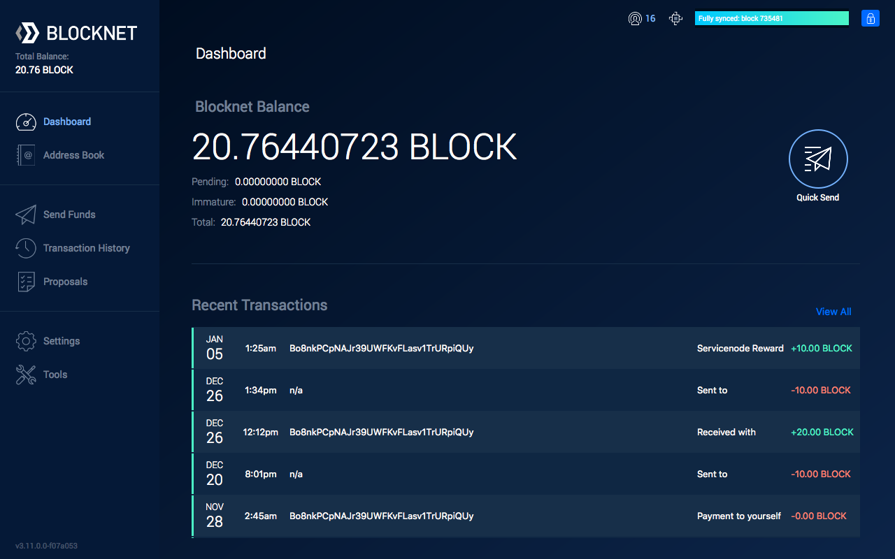

# Proposal Voting

This guide explains how to vote on Blocknet's [Superblock](https://docs.blocknet.co/governance/introduction/#superblock) proposals for funding initiatives and governance management. Voting on proposals is important for the decentralized governance model to function properly.

Proposals should be carefully reviewed along with the amount requested. It's a good idea to consider the total Superblock budget (40,000 BLOCK), the other proposals amounts requested, the priorities of the project, and if the proposal aligns with those priorities and greater vision of the project. The link for each proposal should lead to a description of what the proposal is for with background information and objectives. See [how to view proposals](https://docs.blocknet.co/governance/view-proposals).


**Voting Requirements & Important Information**

**5000** [**BLOCK**](https://docs.blocknet.co/blockchain/introduction) **is required in order to vote.** The process of voting can take place from a wallet containing at least 5000 BLOCK, or a Service Node collateral wallet. An active [Service Node](https://docs.blocknet.co/service-nodes/introduction) is _not_required.

* **Voting for proposals ends 60 blocks prior the Superblock.** It'd be safer to make sure you vote no later than 61 blocks before the Superblock to make sure your voting transaction gets at least 1 confirmation. See next voting deadline [here](https://docs.blocknet.co/governance/introduction/#superblock-voting-deadline).
* The inputs (UTXOs) used for the 5000 BLOCK (to vote) must be 100 BLOCK or larger.
* The inputs used for the 5000 BLOCK must be in the same address.
* Since the votes are recorded on-chain, casting a vote requires you to pay a network fee. This requires _each address_ to have an input _separate_ from the inputs used for the 5000 BLOCK to pay for the network fees. **This input used for the fee cannot be immature**. Funds will remain immature for about 60 minutes (60 blocks) after they staked.
* If you are staking, your vote will automatically re-cast.
* Your vote is not counted until the voting transaction fee has 1 confirmation (typically 1 minute), after which your votes will be accounted for when viewing the `listproposals`command.
* If you vote again you will have to pay another network fee to do so.
* The voting system will automatically calculate how many votes you have available according to your balance (1 vote per 5000 BLOCK) and cast your full vote weight when voting (5562 BLOCK balance = 1 vote, 49635 BLOCK balance = 9 votes.
* The deadline for creating proposals is 2880 blocks prior to the Superblock. See next proposal submission deadline [here](https://docs.blocknet.co/governance/create-proposal/#proposal-submission-deadline).


<details>

<summary>Examples Of Valid Input Setups</summary>

1. Counts as 1 single vote:
   * Address A
     * Inputs: 2500, 2500, 1 (tx fee input)
     * Total: 5000 + 1 (tx fee input)
2. Counts as 1 single vote:
   * Address A
     * Inputs: 500, 500, 500, 500, 500, 500, 500, 500, 500, 500, 1 (tx fee input)
     * Total: 5000 + 1 (tx fee input)
3. Counts as 1 single vote wth excess (inefficient):
   * Address A
     * Inputs: 3000, 2500, 2500, 1 (tx fee input)
     * Total: 8000 + 1 (tx fee input)
   * Address B
     * Inputs: 3000 + 1 (tx fee input)
     * Total: 3000 + 1 (tx fee input)
4. Counts as 1 vote (inefficient):
   * Address A
     * Inputs: 2000, 2000, 1000, 1 (tx fee input)
     * Total: 5000 + 1 (tx fee input)
   * Address B
     * Inputs: 3000, 2000
     * Total: 5000 (no tx fee input)
5. Counts as 2 votes:
   * Address A
     * Inputs: 3000, 3000, 3000, 1000, 1 (tx fee input)
     * Total: 10000 + 1 (tx fee input)
6. Counts as 3 votes with excess (inefficient):
   * Address A
     * Inputs: 5000, 3000, 2000, 2000, 1 (tx fee input)
     * Total: 12000 + 1 (tx fee input)
   * Address B
     * Inputs: 3000, 3000, 2000, 1000, 1 (tx fee input)
     * Total: 9000 + 1 (tx fee input)

</details>

<details>

<summary>Examples Of Invalid Input Setups</summary>

1. Not at least 5000 BLOCK:
   * Address A
     * Inputs: 2500, 2000, 1 (tx fee input)
     * Total: 4500 + 1 (tx fee input)
2. Not enought to cover fee:
   * Address A
     * Inputs: 2500, 2500
     * Total: 5000
3. Fee is not a separate input:
   * Address A
     * Inputs: 2500, 2501
     * Total: 5001
4. 5000 BLOCK not in a single address:
   * Address A
     * Inputs: 4000, 1 (tx fee input)
     * Total: 4000 + 1 (tx fee input)
   * Address B
     * Inputs: 3000, 1 (tx fee input)
     * Total: 3000 + 1 (tx fee input)

</details>

### Voting from the Qt Wallet <a href="#voting-from-the-qt-wallet" id="voting-from-the-qt-wallet"></a>

There are two Qt wallets, with the Redesign geared towards being more user friendly. Below is a comparison between the Classic and Redesign Qt wallets.

| Qt Version              | Redesign (GUI) | Redesign (console) | Classic (console) |
| ----------------------- | -------------- | ------------------ | ----------------- |
| Doesn't require console |                |                    |                   |
| Lists proposals         |                |                    |                   |
| Shows descriptions      | (has link)     | (has link)         | (has link)        |
| Shows vote counts       |                |                    |                   |
| Shows pass/fail status  |                |                    |                   |
| Shows amounts requested |                |                    |                   |
| Shows deposit addresses |                |                    |                   |
| Shows past proposals    |                |                    |                   |
| Easy to navigate        |                |                    |                   |
| Simple voting UI        |                |                    | <p><br></p>       |

<details>

<summary>Vote using the redesigned wallet</summary>



1. Open the [wallet](https://docs.blocknet.co/wallet/setup) and in the side menu, go to _Proposals_. The wallet needs to be unlocked to cast votes.
2.  The Proposals screen shows all the proposals submitted to the network. Above the list of proposals there is an option to filter by _Upcoming_, which displays the proposals that can currently be voted on. Select this filter to view all proposals currently open for voting.

    
3. **Review the proposals and the amount requested.** It's a good idea to consider the total Superblock budget, the other proposals amounts requested, the priorities of the project, and if the proposal aligns with those priorities and greater vision of the project. The link for each proposal should lead to a description of what the proposal is for with some background information and objectives.
4. The voting system will automatically calculate how many votes you have available according to your balance (1 vote per 5000 BLOCK) and cast your full vote weight when voting (5562 BLOCK balance = 1 vote, 49635 BLOCK balance = 9 votes.
5. When ready to vote on a proposal, select the _Vote_ button. A popup will appear that will be used to vote from. Select whether you'd like to approve the proposal (_Yes_) or vote against the proposal (_No_). After you have selected how you wish to vote, select the _Vote_ button. This registers your vote to the network after the vote transaction has 1 confirmation (about 1 minute).
6.  Once you have voted you can change your vote by selecting the _Change Vote_ button and selecting you new vote.&#x20;

    
7. Voting has now been completed.

<!---->

1. Repeat this process for every proposal you are voting for.
2. Your vote is not counted until the voting transaction fee has 1 confirmation (typically 1 minute), after which your votes will be accounted for.
3. If you spend any of your 5000 BLOCK inputs after you vote, the vote is marked invalid and you will need to cast your vote(s) again.
4. If you are staking, your vote will automatically re-cast.

</details>

<details>

<summary>Vote using the classic wallet</summary>


1. Open the [wallet](https://docs.blocknet.co/wallet/setup). The wallet needs to be unlocked to cast votes.
2. In the program menu, go to _Window_ > _Console_. The debug console will open in a new window.
3. In the input field at the bottom, type in `listproposals`, then press the _Enter_ key. To view proposals since a specific block, use `listproposals [BLOCK_NUMBER]` instead. Example: `listproposals 1209600`
4. A message showing all proposals will be returned.
5. **Review the proposals and the amount requested.** It's a good idea to consider the total Superblock budget, the other proposals amounts requested, the priorities of the project, and if the proposal aligns with those priorities and greater vision of the project. The link for each proposal should lead to a description of what the proposal is for with some background information and objectives.
6. The proposal hash, which is a unique identifier for the proposal, can be found in each proposal’s details. The voting command uses the following command structure: `vote [PROPOSAL_HASH] [VOTE]`
   * `PROPOSAL_HASH`: The hash of the proposal you are voting for
     * `VOTE`: Your vote (‘yes’ or ‘no’). `yes` means you'd like to vote to fund the proposal and `no` means you'd like to vote against the proposal so it isn't funded.
7. The voting system will automatically calculate how many votes you have available according to your balance (1 vote per 5000 BLOCK) and cast your full vote weight when voting (5562 BLOCK balance = 1 vote, 49635 BLOCK balance = 9 votes.
8.  To vote, type the above command with `[PROPOSAL_HASH]` and `[VOTE]` replaced with the respective variables in place. Below is an example:

    ```
    vote 06a50c125aa305fbe38fa0fe9a1b39db1b1318838aadaec55f95c7a52101d83f yes
    ```
9. Press the _Enter_ key to submit the command and register your vote to the network.
10. Voting has now been completed.

<!---->

1. Repeat this process for every proposal you are voting for.
2. Your vote is not counted until the voting transaction fee has 1 confirmation (typically 1 minute), after which your votes will be accounted for.
3. If you spend any of your 5000 BLOCK inputs after you vote, the vote is marked invalid and you will need to cast your vote(s) again.
4. If you are staking, your vote will automatically re-cast.

</details>

### Voting from the Terminal <a href="#voting-from-the-terminal" id="voting-from-the-terminal"></a>

<details>

<summary>Linux</summary>


1. Start the [wallet](https://docs.blocknet.co/wallet/setup). If it's not already running, use the following instructions to start it.&#x20;
   1. Navigate to the `bin` folder within your Blocknet wallet installation directory (EG: `~/blocknet/bin/`)
   2.  Type in the following command, replacing `[USERNAME]` and `[PASSWORD]` with the respective `rpcuser=` and `rpcpassword=` values from your `blocknet.conf` file located in your `~/.blocknet/` directory.

       ```
       ./blocknetd -rpcuser=[USERNAME] -rpcpassword=[PASSWORD] -daemon
       ```

       _Example:_

       ```
       ./blocknetd -rpcuser=JohnBlocknet -rpcpassword=supersecretpassword -daemon
       ```
2. The wallet process will begin in the current terminal window. You will need to open a new terminal window or tab and navigate to the same location before continuing.
3.  If your wallet was just started, you may need to wait a few minutes for the proposals to sync, otherwise you may not see the full list of proposals. Use the following command to view the proposals:

    ```
    ./blocknet-cli listproposals
    ```
4.  To view proposals since a specific block:

    ```
    ./blocknet-cli listproposals [BLOCK_NUMBER]
    ```

    _Example:_

    ```
    ./blocknet-cli listproposals 1209600
    ```
5. **Review the proposals and the amount requested.** It's a good idea to consider the total Superblock budget, the other proposals amounts requested, the priorities of the project, and if the proposal aligns with those priorities and greater vision of the project. The link for each proposal should lead to a description of what the proposal is for with some background information and objectives.
6. The voting system will automatically calculate how many votes you have available according to your balance (1 vote per 5000 BLOCK) and cast your full vote weight when voting (5562 BLOCK balance = 1 vote, 49635 BLOCK balance = 9 votes.
7.  Vote for the proposal using the following command, replacing the variable with the respective values:

    ```
    ./blocknet-cli vote [PROPOSAL_HASH] [VOTE]
    ```

    * `PROPOSAL_HASH`: The hash listed for the proposal you are voting for
      * `VOTE`: Your vote (‘yes’ or ‘no’). `yes` means you'd like to vote to fund the proposal and `no` means you'd like to vote against the proposal so it isn't funded.

    _Example:_

    ```
    ./blocknet-cli vote 06a50c125aa305fbe38fa0fe9a1b39db1b1318838aadaec55f95c7a52101d83f yes
    ```
8. Press the _Enter_ key to submit the command and register your vote to the network.
9. Voting has now been completed.

* Repeat this process for every proposal you are voting for.
* Your vote is not counted until the voting transaction fee has 1 confirmation (typically 1 minute), after which your votes will be accounted for.
* If you spend any of your 5000 BLOCK inputs after you vote, the vote is marked invalid and you will need to cast your vote(s) again.
* If you are staking, your vote will automatically re-cast.

</details>

<details>

<summary>Windows</summary>

1. Start the [wallet](https://docs.blocknet.co/wallet/setup). If it's not already running, use the following instructions to start it.&#x20;
2.  Type in the following command, replacing `[USERNAME]` and `[PASSWORD]` with the respective `rpcuser=` and `rpcpassword=` values from your `blocknet.conf` file located in the `C:\Users\[YourUsername]\AppData\Roaming\Blocknet` directory. This directory can be found by opening the file explorer and pasting in `%appdata%\Blocknet\` into the file explorer path field.

    ```
    blocknetd -rpcuser=[USERNAME] -rpcpassword=[PASSWORD]
    ```

    _Example:_

    ```
    blocknetd -rpcuser=JohnBlocknet -rpcpassword=supersecretpassword
    ```


3. The wallet process will begin in the current terminal window. You will need to open a new terminal window or tab and navigate to the same location before continuing.
4.  If your wallet was just started, you may need to wait a few minutes for the proposals to sync, otherwise you may not see the full list of proposals. Use the following command to view the proposals:

    ```
    ./blocknet-cli listproposals
    ```


5.  To view proposals since a specific block:

    ```
    ./blocknet-cli listproposals [BLOCK_NUMBER]
    ```

    _Example:_

    ```
    ./blocknet-cli listproposals 1209600
    ```

    ****
6.  **Review the proposals and the amount requested.** It's a good idea to consider the total Superblock budget, the other proposals amounts requested, the priorities of the project, and if the proposal aligns with those priorities and greater vision of the project. The link for each proposal should lead to a description of what the proposal is for with some background information and objectives.


7.  The voting system will automatically calculate how many votes you have available according to your balance (1 vote per 5000 BLOCK) and cast your full vote weight when voting (5562 BLOCK balance = 1 vote, 49635 BLOCK balance = 9 votes.


8.  Vote for the proposal using the following command, replacing the variable with the respective values:

    ```
    ./blocknet-cli vote [PROPOSAL_HASH] [VOTE]
    ```

    * `PROPOSAL_HASH`: The hash listed for the proposal you are voting for
    * `VOTE`: Your vote (‘yes’ or ‘no’). `yes` means you'd like to vote to fund the proposal and `no` means you'd like to vote against the proposal so it isn't funded.

    _Example:_

    ```
    ./blocknet-cli vote 06a50c125aa305fbe38fa0fe9a1b39db1b1318838aadaec55f95c7a52101d83f yes
    ```


9. Press the _Enter_ key to submit the command and register your vote to the network.
10. Voting has now been completed.

* Repeat this process for every proposal you are voting for.
* Your vote is not counted until the voting transaction fee has 1 confirmation (typically 1 minute), after which your votes will be accounted for.
* If you spend any of your 5000 BLOCK inputs after you vote, the vote is marked invalid and you will need to cast your vote(s) again.
* If you are staking, your vote will automatically re-cast.

</details>

<details>

<summary>Mac</summary>

1. Start the [wallet](https://docs.blocknet.co/wallet/setup). If it's not already running, use the following instructions to start it.
2. Type in the following command, replacing `[USERNAME]` and `[PASSWORD]` with the respective `rpcuser=` and `rpcpassword=` values from your `blocknet.conf` file located in your `~/Library/Application Support/Blocknet/` directory. This directory can be found by opening the Finder, in the program menu selecting _Go_ > _Go to Folder_, entering `~/Library/Application Support/Blocknet/` in the path, and pressing _Enter_.

```
./blocknetd -rpcuser=[USERNAME] -rpcpassword=[PASSWORD] -daemon
```

_Example:_

```
./blocknetd -rpcuser=JohnBlocknet -rpcpassword=supersecretpassword -daemon
```

1. The wallet process will begin in the current terminal window. You will need to open a new terminal window or tab and navigate to the same location before continuing.
2.  If your wallet was just started, you may need to wait a few minutes for the proposals to sync, otherwise you may not see the full list of proposals. Use the following command to view the proposals:

    ```
    ./blocknet-cli listproposals
    ```
3.  To view proposals since a specific block:

    ```
    ./blocknet-cli listproposals [BLOCK_NUMBER]
    ```

    _Example:_

    ```
    ./blocknet-cli listproposals 1209600
    ```
4. **Review the proposals and the amount requested.** It's a good idea to consider the total Superblock budget, the other proposals amounts requested, the priorities of the project, and if the proposal aligns with those priorities and greater vision of the project. The link for each proposal should lead to a description of what the proposal is for with some background information and objectives.
5. The voting system will automatically calculate how many votes you have available according to your balance (1 vote per 5000 BLOCK) and cast your full vote weight when voting (5562 BLOCK balance = 1 vote, 49635 BLOCK balance = 9 votes.
6.  Vote for the proposal using the following command, replacing the variable with the respective values:

    ```
    ./blocknet-cli vote [PROPOSAL_HASH] [VOTE]
    ```

    * `PROPOSAL_HASH`: The hash listed for the proposal you are voting for
    * `VOTE`: Your vote (‘yes’ or ‘no’). `yes` means you'd like to vote to fund the proposal and `no` means you'd like to vote against the proposal so it isn't funded.

    _Example:_

    ```
    ./blocknet-cli vote 06a50c125aa305fbe38fa0fe9a1b39db1b1318838aadaec55f95c7a52101d83f yes
    ```
7. Press the _Enter_ key to submit the command and register your vote to the network.
8. Voting has now been completed.

* Repeat this process for every proposal you are voting for.
* Your vote is not counted until the voting transaction fee has 1 confirmation (typically 1 minute), after which your votes will be accounted for.
* If you spend any of your 5000 BLOCK inputs after you vote, the vote is marked invalid and you will need to cast your vote(s) again.
* If you are staking, your vote will automatically re-cast.

</details>
